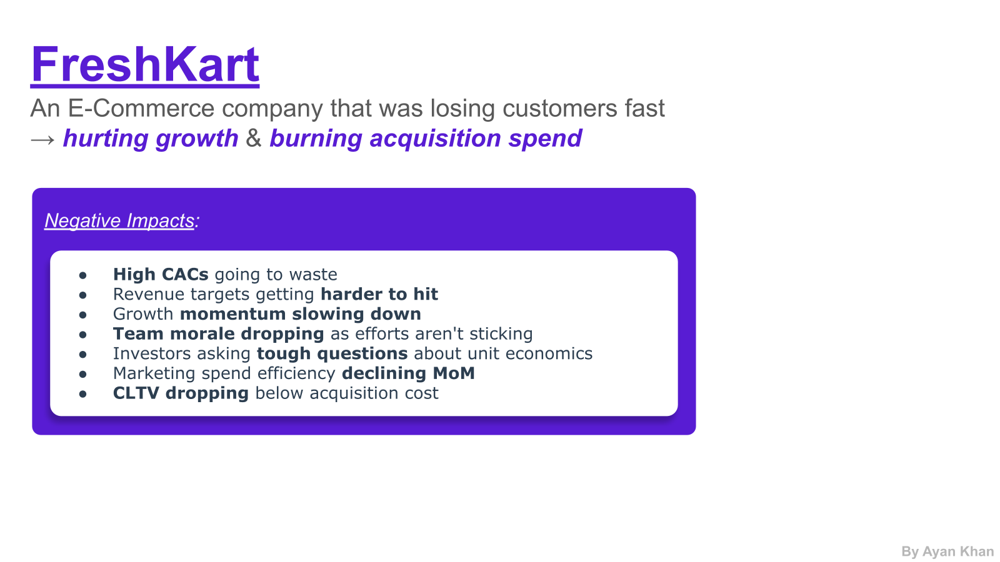
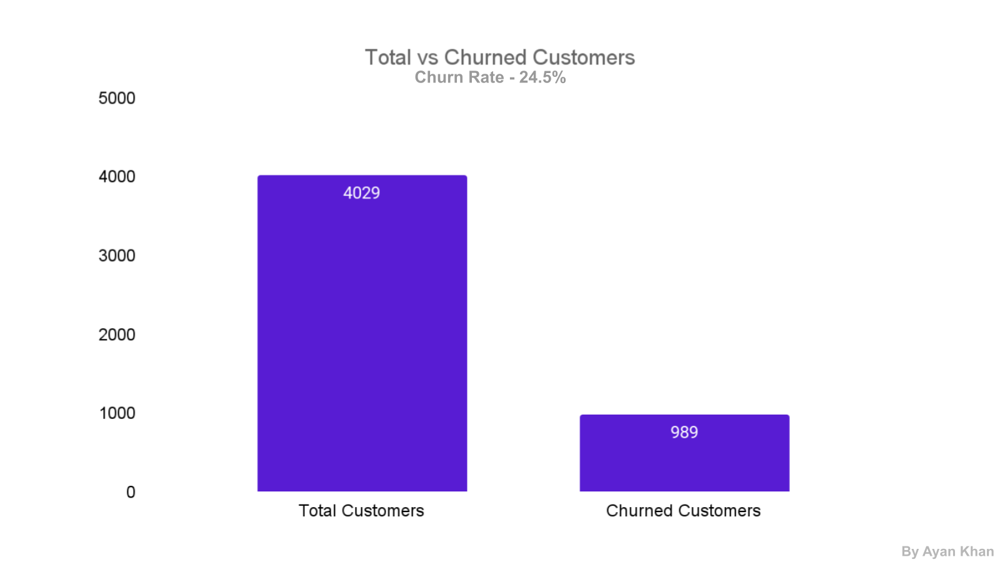
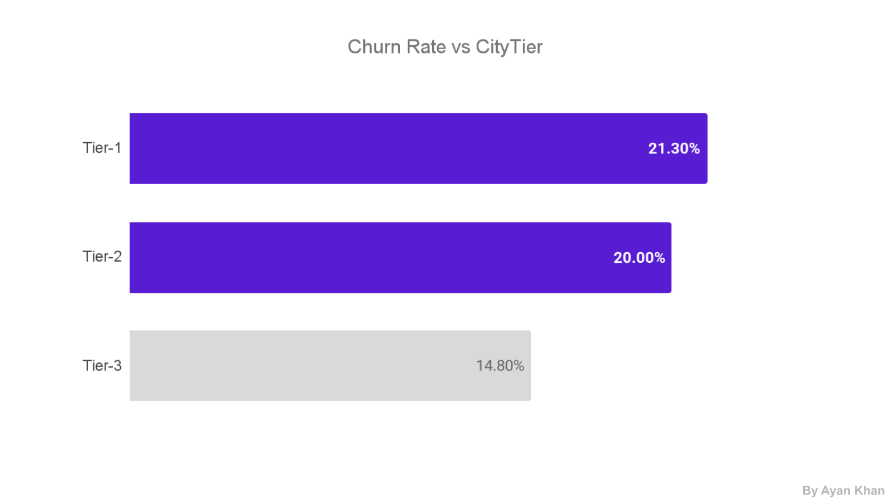
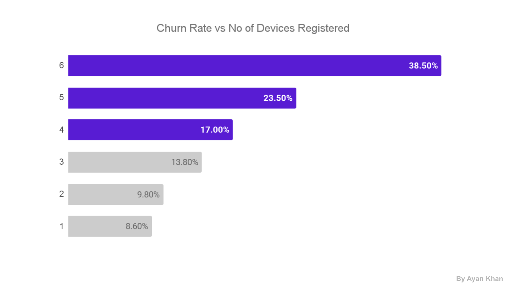
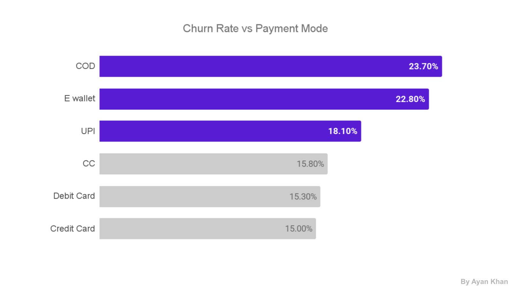
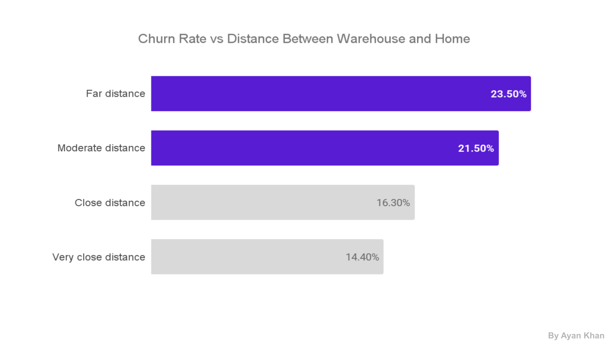
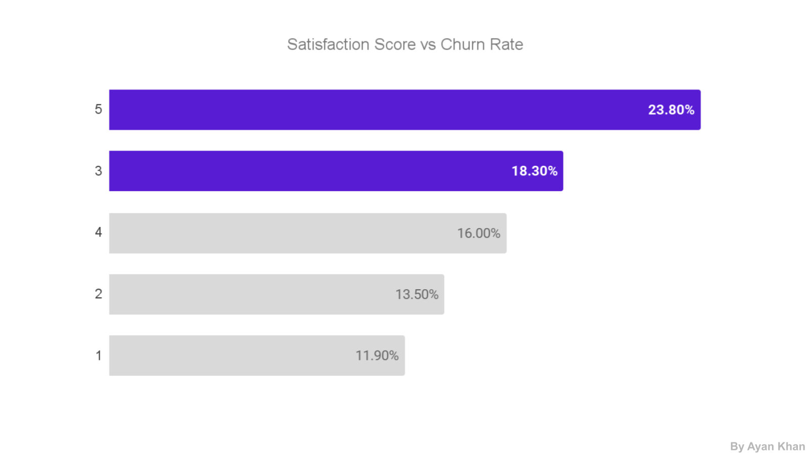
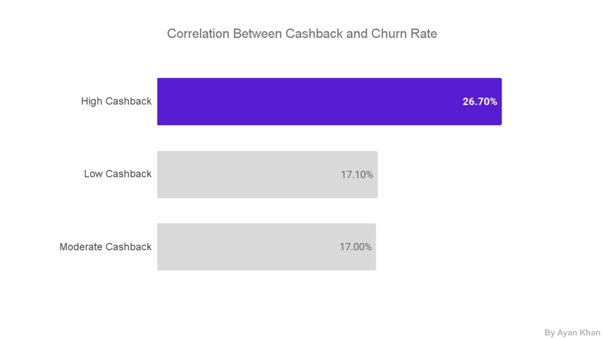
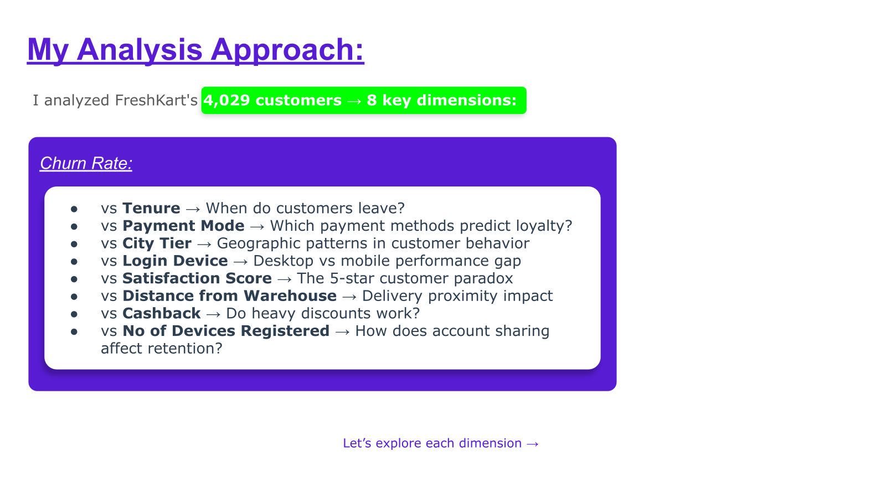

# FreshKart Customer Churn Root Cause Analysis


## Full Report / Detailed Presentation

**For the complete analysis, check out the full PDF presentation:**

**[View Full Customer Churn Analysis PDF](Customer_ChurnAnalysis.pdf)**

The PDF includes the **complete data visualization deck**, **detailed churn insights**, **root cause analysis**, and **business recommendations**. This GitHub README provides a **brief, recruiter-friendly version** of the project so the main business story can be understood quickly.

## 30-Second Summary

FreshKart, an e-commerce business, had a **24.5% customer churn problem** across **4,029 customers**. I analyzed churn across **tenure, payment mode, city tier, login device, registered devices, satisfaction score, warehouse distance, and cashback behavior** to identify why customers were leaving.

The goal was to move beyond dashboard reporting and turn the analysis into clear business decisions: **reduce avoidable churn, protect acquisition spend, improve repeat purchases, and build stronger customer loyalty.**

## Business Problem

FreshKart was acquiring customers, but too many were leaving before becoming repeat buyers. This created a direct business risk:

| Risk | Why It Matters |
|---|---|
| **Wasted CAC** | Acquisition spend was not converting into long-term customer value. |
| **Lower CLTV** | Customers were leaving before becoming profitable. |
| **Slower Growth** | Retention issues made revenue targets harder to hit. |
| **Poor Unit Economics** | Marketing spend efficiency declined as churn increased. |



## Data Visualizations & Insights

### Overall Churn



**Insight:** FreshKart's churn problem is large enough to affect **growth, acquisition efficiency, and lifetime value**. The issue is not only getting customers into the funnel, but keeping them long enough to become repeat buyers.

---

### City Tier Churn



**Insight:** Metro customers have **higher expectations and more alternatives**. Smaller service failures can lead to faster churn because competitors are always one click away.

---

### Registered Devices Churn



**Insight:** Churn rises sharply as registered devices increase. **Single-device users had 8.6% churn**, while **six-device users had 38.5% churn**, suggesting account sharing, weak personalization, and security concerns.

---

### Payment Mode Churn



**Insight:** **Payment mode is a strong loyalty signal.** COD users are more likely to be low-trust, one-time buyers, while digital payment users are more likely to shop repeatedly.

---

### Distance From Warehouse



**Insight:** Customers farther from the warehouse face **slower delivery, broken expectations, and weaker service experience**. Distance becomes a retention problem when promises are not matched by operations.

---

### Satisfaction Score Paradox



**Insight:** **High satisfaction does not automatically mean loyalty.** A 5-star experience can create a higher expectation baseline, and customers may churn if the next experience feels worse.

---

### Cashback Behavior



**Insight:** Heavy cashback can attract **bargain seekers who leave when offers reduce**. Discounting may increase transactions, but it does not always build long-term loyalty.

## Analysis Approach

The analysis focused on **eight churn dimensions**:

- **Customer tenure**
- **Payment mode**
- **City tier**
- **Login device**
- **Satisfaction score**
- **Distance from warehouse**
- **Cashback behavior**
- **Number of registered devices**



## Root Causes & Recommendations

| Churn Driver | Root Cause | Recommendation | Business Impact |
|---|---|---|---|
| **New Customers** | Low trust and weak first experience | Add trust badges, customer reviews, clear return policy, and WhatsApp onboarding | **Improves early retention** |
| **Metro Customers** | Higher expectations and more alternatives | Offer metro loyalty perks, priority support, and local campaigns | **Reduces urban churn** |
| **Desktop Users** | Higher checkout friction than mobile | Push users to app with QR checkout and app-only offers | **Improves conversion and repeat purchase** |
| **Registered Devices** | Account sharing weakens personalization | Focus offers on top 1-2 devices and position device limits as security | **Improves relevance and trust** |
| **COD Users** | Low trust and one-time purchase mindset | Introduce partial COD and UPI migration incentives | **Improves payment quality and loyalty** |
| **Far Customers** | Slow delivery and broken promises | Add honest ETA alerts, delivery perks, and micro-warehouse planning | **Reduces delivery-led churn** |
| **5-Star Customers** | Peak experience creates fragile loyalty | Trigger loyalty perks immediately after positive feedback | **Converts satisfaction into retention** |
| **Cashback Users** | Discount dependency | Replace flat cashback with milestone rewards, free gifts, and early access | **Builds repeat behavior** |

## Business Impact

This analysis helps FreshKart move from **reactive churn tracking** to **targeted retention strategy**.

Expected impact areas:

- **Lower wasted acquisition spend**
- **Higher repeat purchase rate**
- **Better customer lifetime value**
- **Improved COD-to-digital payment migration**
- **Stronger delivery experience for distance-sensitive customers**
- **More efficient retention budget allocation**
- **Loyalty programs built around behavior, not blanket discounts**

## Skills Demonstrated

- Customer churn analysis
- Root cause analysis
- KPI design
- Customer segmentation
- E-commerce analytics
- Business storytelling
- Retention strategy
- Recommendation design
- Executive communication

## Repository Structure

```text
E-commerce-Customer-Churn-Analysis/
|-- README.md
|-- Customer_ChurnAnalysis.pdf
|-- screenshots/
|   |-- 01_project_cover.png
|   |-- 02_business_problem.png
|   |-- 03_analysis_approach.png
|   |-- 04_overall_churn_rate.png
|   |-- 05_tenure_churn_chart.png
|   |-- 06_tenure_rca.png
|   |-- ...
|   |-- 22_analyst_profile.png
|-- docs/
|   |-- full-analysis.md
```
