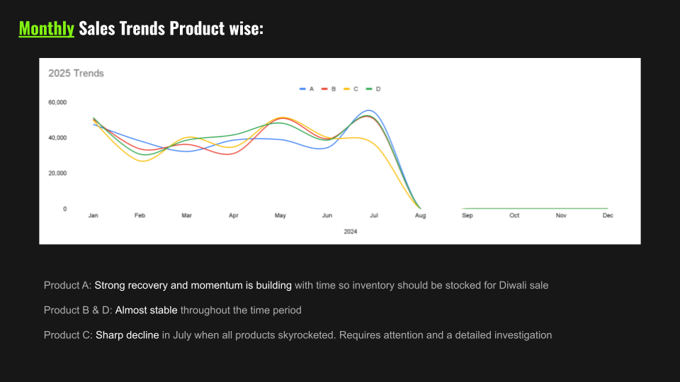
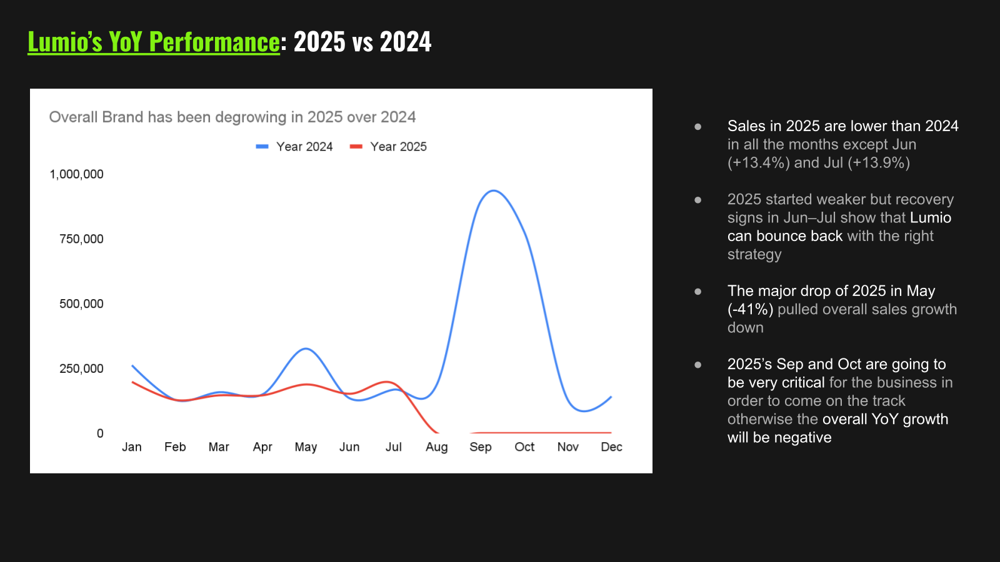
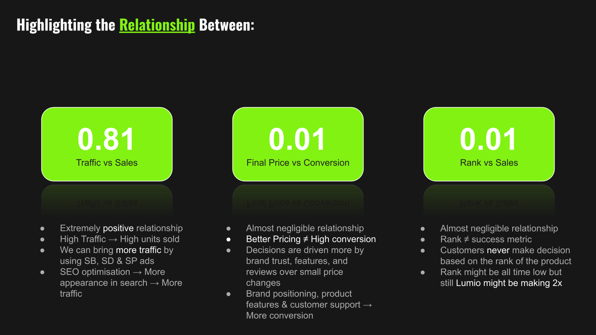
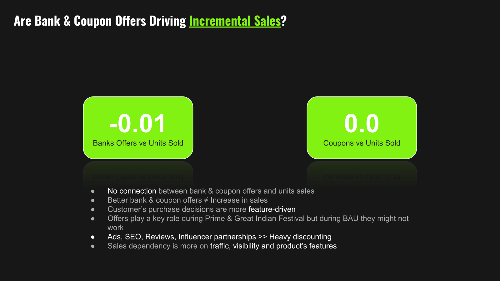
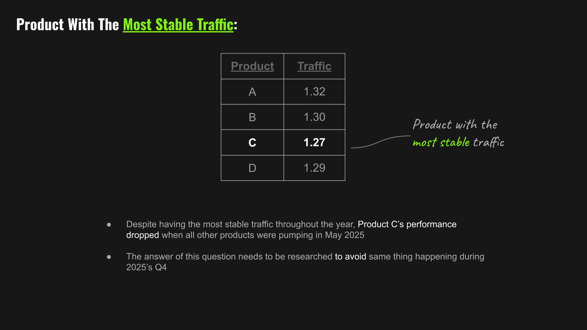
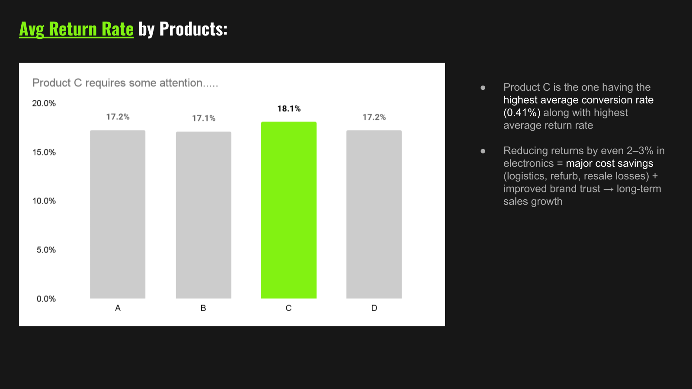
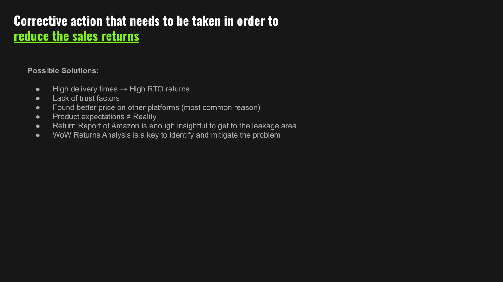
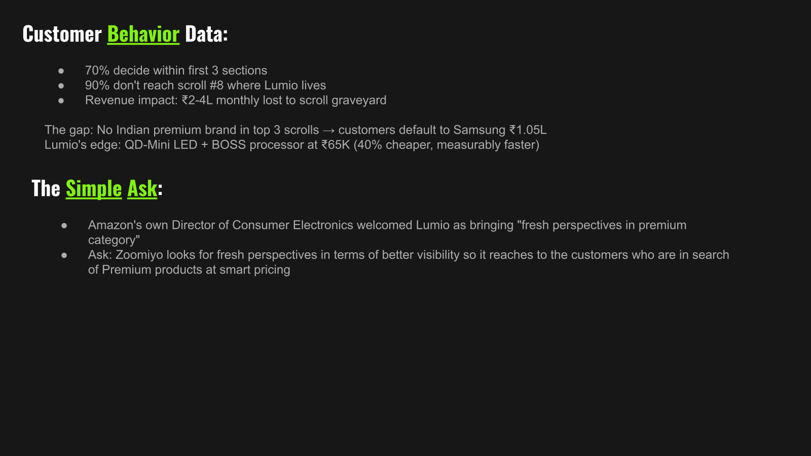

# Indian TV Brand Marketplace Visibility & Sales Recovery Analysis


## Full Report

This repository contains the **brief GitHub case study** for quick recruiter review.  
For the complete presentation with **data visualizations, detailed insights, corrective actions, and business recommendations**, please check the full PDF report:

**[View Full Presentation PDF](presentation/Indian-TV-Brand-Marketplace-Visibility-Analysis.pdf)**

## Overview

This case study analyzes the marketplace performance of a real Indian smart TV brand launched in 2023. The analysis focuses on sales trends, traffic behavior, conversion signals, return patterns, discount effectiveness, and marketplace visibility challenges.

The goal was to understand why the brand was not converting its marketplace potential into stronger sales, especially when traffic and product value proposition showed signs of opportunity.

The analysis was built from a business assignment focused on **e-commerce and quick commerce marketplace performance**, where the expected output was an analysis file with charts, pivots, calculations, and a recommendation report with insights and suggested actions.

## Business Problem

The brand had a strong product proposition in the premium smart TV category, but its marketplace performance was being limited by visibility, conversion, and return-related issues.

The key business question was:

**How can a newer Indian TV brand improve marketplace sales without relying heavily on discounts or extra marketing spend?**

## Problem Statement

The assignment required analyzing Amazon product performance data for four product models: **Product A, Product B, Product C, and Product D**.

The analysis needed to answer three business areas:

1. **Understanding trends:** Identify monthly or weekly sales trends, study relationships between traffic, sales, price, conversion, rank, offers, and returns.
2. **Corrective actions:** Diagnose why a product with stable traffic was declining in sales, reduce returns for the highest-return product, and suggest zero-investment actions to improve sales.
3. **Qualitative marketplace review:** Analyze the Amazon Television category page and prepare a business pitch to increase Lumio's visibility on the page.

## Objective

- Identify sales and traffic patterns across product lines.
- Compare year-over-year performance to detect growth gaps.
- Test whether **traffic, price, offer price, rank, bank offers, and coupons** were meaningfully linked with sales or conversion.
- Identify the product with the most stable traffic.
- Identify the product with the highest returns.
- Find root causes behind declining product performance.
- Recommend corrective actions to improve sales, reduce returns, and strengthen marketplace visibility.

## Dataset / Source

The project is based on marketplace business data and presentation analysis covering:

- Date-level Amazon product performance data
- Model-level product identifiers: Product A, Product B, Product C, and Product D
- List price, bank offer, coupon, and final offer price
- Bank offer adoption and coupon adoption
- Product-page traffic
- Amazon category rank
- Conversion rate
- Units sold
- Customer returns
- Monthly product-wise sales trends
- Year-over-year sales performance
- Marketplace visibility and category-page positioning review

## Data Visualizations & Insights

### 1. Product-Wise Monthly Sales Trends



**Product A showed strong recovery and momentum**, making it a good candidate for stronger stock planning before key festive demand periods such as Diwali.

**Product B and Product D remained relatively stable**, which suggests fewer immediate performance risks compared with the rest of the portfolio.

**Product C showed a sharp sales decline in July while other products improved**, making it the most important product for deeper investigation.

---

### 2. Year-over-Year Performance



The brand performed below the previous year in most months. The only positive months were **June and July**, where sales grew by approximately **13.4% and 13.9%** respectively.

The biggest concern was **May 2025**, where sales dropped by around **41%**, pulling down overall growth momentum.

**September and October were identified as critical months** because weak performance during these months could push the brand into negative year-over-year growth during an important retail season.

---

### 3. Traffic, Price, Rank, and Sales Relationship



Traffic had a strong positive relationship with sales, with a correlation of approximately **0.81**. This means visibility and shopper visits were strongly linked with business outcomes.

Final price had almost no relationship with conversion, with a correlation of approximately **0.01**. This suggests that shoppers were not deciding only because of price. Trust, reviews, content quality, features, delivery promise, and comparison clarity likely mattered more.

Marketplace rank also showed almost no relationship with sales. This means rank alone should not be treated as the main success metric.

---

### 4. Bank Offers and Coupon Impact



Bank offers and coupons did not show meaningful incremental sales impact during business-as-usual periods.

The relationship between bank offers and units sold was approximately **-0.01**, while coupons and units sold showed almost **0.00** correlation.

This means the brand should avoid depending only on discounting. Better results may come from improving traffic quality, SEO, customer trust, reviews, product-page content, and competitive positioning.

---

### 5. Stable Traffic but Weak Sales



Product C had relatively stable traffic, but sales still declined. This is important because stable traffic means customers were still reaching the product page.

The issue was likely not visibility alone. The deeper problem appeared to be **conversion quality**, including pricing perception, trust gaps, comparison gaps, delivery concerns, reviews, or product-page communication.

---

### 6. Return Rate and Conversion Risk



Product C had the highest average conversion rate but also the highest average return rate.

This is a strong business signal. The product was able to attract and convert customers, but the post-purchase experience may not have matched expectations.

Reducing returns by even **2-3%** in electronics can protect profit by lowering reverse logistics, refurbishment cost, resale loss, and brand trust damage.

---

### 7. Corrective Actions



The corrective actions focused on improving conversion without simply increasing discounts:

- Improve SEO titles and keyword coverage.
- Track performance after every listing change.
- Monitor competitor pricing, content, and reviews.
- Add stronger comparison tables against leading TV brands.
- Improve A+ content and use high-quality product videos.
- Highlight customer problems solved, not only technical features.
- Analyze negative review sentiment and reduce repeat complaints.
- Investigate delivery delays, expectation mismatch, and return reasons.

---

### 8. Marketplace Visibility Pitch



The analysis also built a business case for stronger marketplace visibility.

A key insight was that many customers decide within the first few category-page sections, while the brand appeared much lower on the page. This reduced discovery despite the brand having a premium value proposition.

The pitch connected visibility improvement to a clear business win for all sides:

- **Amazon wins** through higher category revenue and better customer choice.
- **Customers win** through access to a stronger value-for-money premium TV option.
- **The brand wins** through visibility that matches its product strength.

## Analysis Approach

The analysis followed a business-first structure:

1. **Trend diagnosis:** Reviewed product-wise monthly sales movement to identify recovery, stability, and decline.
2. **YoY comparison:** Compared current year performance with the previous year to locate growth gaps.
3. **Correlation analysis:** Tested whether traffic, final price, rank, bank offers, and coupons were connected with sales or conversion.
4. **Offer impact review:** Checked whether bank offers and coupons were actually creating incremental sales.
5. **Product deep dive:** Focused on Product C because it had stable traffic but declining sales and high return risk.
6. **Return analysis:** Identified the product with the highest returns and connected it to operational and customer-experience risks.
7. **Category-page review:** Assessed Amazon TV category visibility and built a business case for stronger placement.
8. **Action planning:** Created practical recommendations across SEO, content, pricing perception, reviews, competitor tracking, returns, and marketplace visibility.

## Root Cause Analysis

The analysis found that the issue was not only about price or discounts.

The likely root causes were:

- **Low marketplace visibility:** The product appeared too far down the category page, reducing discovery during high-intent shopping.
- **Conversion friction:** Stable traffic but weaker sales indicated that customers were reaching the page but not buying at the expected rate.
- **Trust and comparison gaps:** Newer brands need stronger proof points, reviews, videos, comparison tables, and clearer value communication.
- **Weak discount impact:** Bank offers and coupons did not show meaningful incremental sales impact during normal periods.
- **Return-rate pressure:** Product C converted customers but also showed high returns, pointing to possible expectation mismatch, delivery issues, or product communication gaps.

## Key Findings

- **Traffic was the strongest sales driver**, showing a strong positive relationship with sales.
- **Price was not the main conversion driver**, meaning discounts alone were unlikely to fix the problem.
- **Bank offers and coupons were not driving meaningful incremental sales** during BAU periods.
- **Product C required immediate attention** because it combined stable traffic, declining sales, high conversion, and high returns.
- **Marketplace placement mattered** because customers often decide before reaching lower category-page positions.
- **The brand had a strong premium value proposition**, but customers needed to see and trust it earlier in the buying journey.

## Recommendations

- Improve category-page visibility for high-intent premium TV shoppers.
- Prioritize traffic quality through SEO, sponsored ads, and stronger product keyword coverage.
- Reduce dependency on discounts and focus on trust-building assets.
- Improve product-page storytelling with comparison tables, review proof, feature clarity, and video-led content.
- Run weekly competitor tracking across price, offers, reviews, ratings, content, and placement.
- Investigate Product C returns using Amazon return reports and week-over-week return analysis.
- Track every major listing/content change against traffic, conversion, sales, and return rate.

## Business Impact

This analysis helps the business move from surface-level reporting to decision-making.

Instead of asking only, “Why are sales down?”, the project identifies where the problem sits:

- discovery
- conversion
- trust
- offer effectiveness
- return behavior
- marketplace positioning

The recommendations are designed to improve sales quality, reduce wasted discounting, protect profitability, and strengthen the brand’s position in a competitive premium TV category.

## Skills Demonstrated

- Business root cause analysis
- Sales trend analysis
- Year-over-year performance analysis
- Product-level performance analysis
- Correlation-based insight generation
- Offer and coupon effectiveness analysis
- Marketplace performance analysis
- Conversion problem diagnosis
- Return-rate analysis
- Competitive positioning
- Category-page visibility assessment
- Business recommendation writing
- Executive storytelling

## Suggested Screenshot Files

- `01_project_cover.png`
- `02_monthly_sales_trends.png`
- `03_yoy_performance.png`
- `04_correlation_analysis.png`
- `05_offer_impact_analysis.png`
- `06_stable_traffic_analysis.png`
- `07_return_rate_analysis.png`
- `08_corrective_actions.png`
- `09_marketplace_visibility_pitch.png`
- `10_business_case.png`

## Folder Structure

```text
Indian-TV-Brand-Marketplace-Visibility-Analysis/
├── README.md
├── presentation/
│   └── Indian-TV-Brand-Marketplace-Visibility-Analysis.pdf
└── screenshots/
    ├── 01_project_cover.png
    ├── 02_monthly_sales_trends.png
    ├── 03_yoy_performance.png
    ├── 04_correlation_analysis.png
    ├── 05_offer_impact_analysis.png
    ├── 06_stable_traffic_analysis.png
    ├── 07_return_rate_analysis.png
    ├── 08_corrective_actions.png
    ├── 09_marketplace_visibility_pitch.png
    └── 10_business_case.png
```
